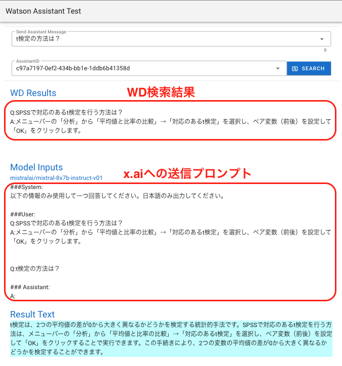
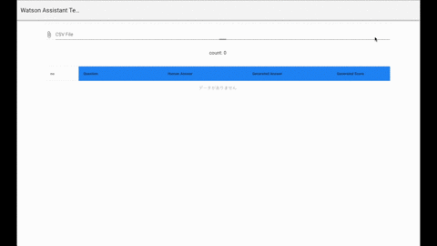

# Watson Assistant Build Assets

## Watson AssistantのリクエストをAPI経由でテストするツール

* StartarKit等でAssistant内でスキルを実装している場合
  * 中間データを取得表示することが可能
  * "./index.html"
  <div>
    
  </div>

* UI側から一括送信することでまとめてテストを行うことができる
  * "./csv_test.html"を開く
  * CSVファイルのテスト一覧を取り込むことが可能
  <div>
    
  </div>
  
  * watsonx.aiと連携させている場合の検索結果の採点を行う
    * RougeScoreで文章の比較を行い点数をつける
    * Xlsx、Jsonファイルの出力
  <div>
    
  </div>


## Python環境のセットアップ
```
# Set virtual environment
python -m venv .venv
source .venv/bin/activate
pip list


# Install the required modules
pip install -r requirements.txt

  or

# add python modules
pip install uvicorn fastapi python-dotenv logging

# add IBM SDK
pip install ibm-watson

# for scores
pip install sumeval janome
```


## Run
* Run Server
  ```
  # python server.py
  ```


## 以下と同手順でアプリのデプロイが可能
### [コンテナサービスへのデプロイ](./doc/ce/deploy_codeengine.md)
